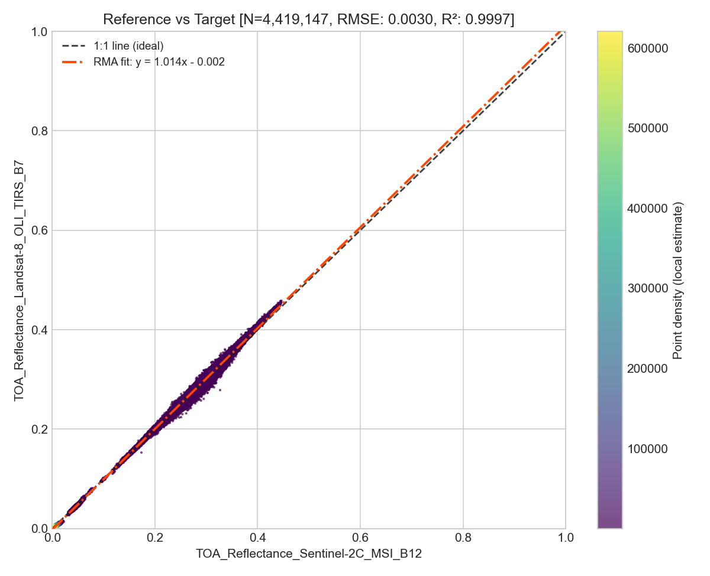
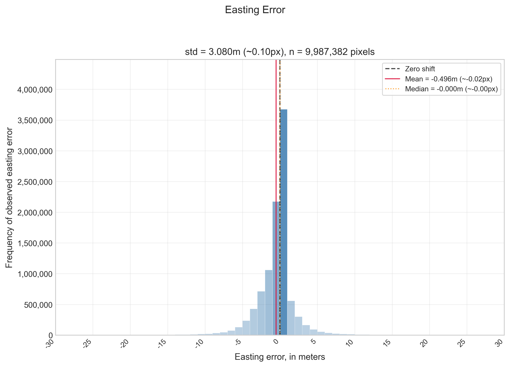
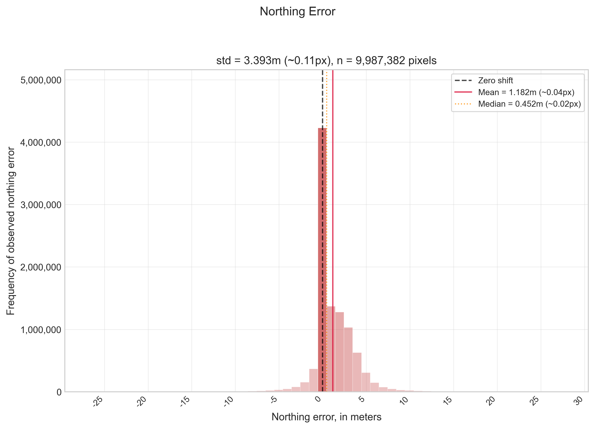
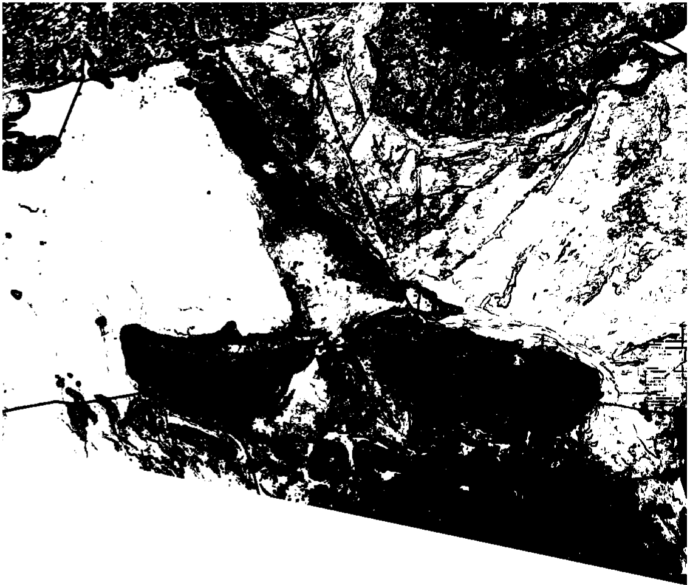
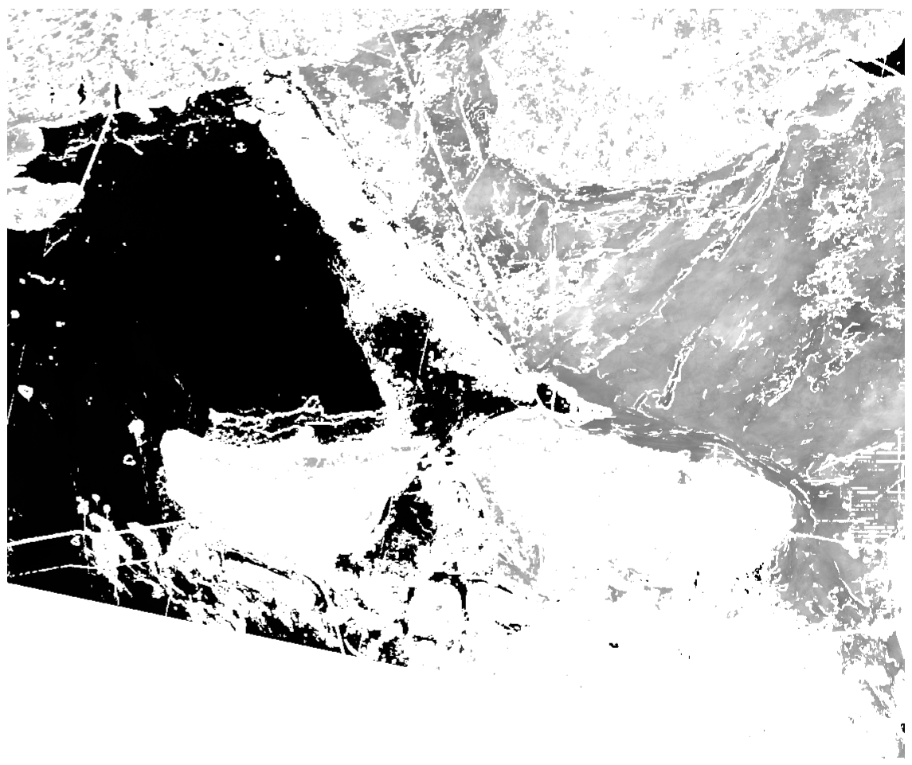
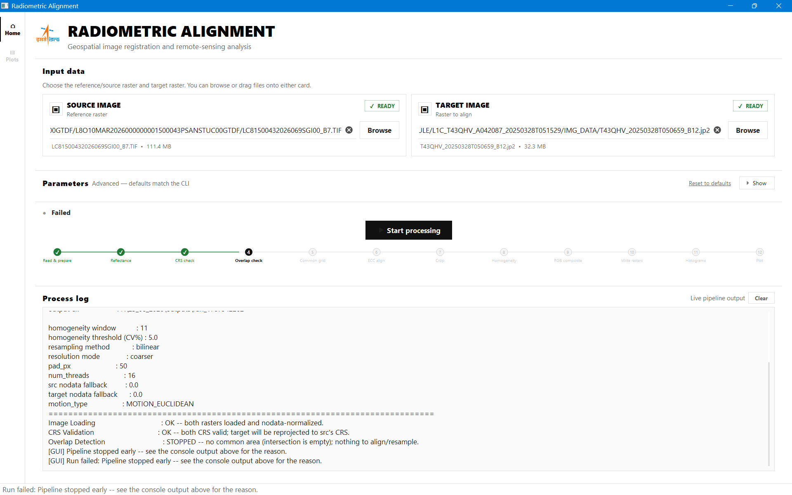

# Radiometric_Align

**Cross-sensor satellite image alignment and radiometric calibration pipeline**, developed during an internship at ISRO's National Remote Sensing Centre (NRSC). It aligns imagery from different satellite sensors onto a common grid and converts them to a physically comparable radiometric scale, so that pixel values and reflectance can be compared directly across sensors (e.g. Cartosat vs. Sentinel-2).

Available both as a scriptable **command-line pipeline** and as a **PyQt5 desktop GUI**.

---

## Table of Contents

- [Features](#features)
- [Screenshots](#screenshots)
- [Installation](#installation)
- [Usage](#usage)
  - [GUI](#gui)
  - [Command Line](#command-line)
- [Pipeline Overview](#pipeline-overview)
- [Project Structure](#project-structure)
- [Outputs](#outputs)
- [Supported Sensors](#supported-sensors)
- [Tech Stack](#tech-stack)

---

## Features

- **Radiometric correction** — Converts raw DN to TOA (Top-of-Atmosphere) reflectance for Cartosat, LISS-3/4, Sentinel-2 (L1C), and Landsat, using sensor-specific solar irradiance values and spectral response functions (including real Landsat-8 OLI SRF data).
- **Sub-pixel image registration** — ECC-based alignment (Euclidean or Affine motion models) for precise co-registration of source and target rasters.
- **MTF/PSF-aware resampling** — Gaussian PSF pre-blur combined with area-weighted block averaging to reproject imagery onto a common grid without degrading registration accuracy; validated against GDAL.
- **Cross-sensor regression analysis** — Reduced Major Axis (RMA) regression for radiometric agreement between sensors, with Theil-Sen regression used as an automated outlier-detection check.
- **Homogeneity & footprint analysis** — Detects spatially homogeneous regions (CV / LSD / GLCM-based) and computes true footprint overlap using polygon intersection (Shapely/Rasterio).
- **Rich diagnostics** — Before/after shift histograms, optical-flow-based shift validation, 2D error hexbin scatter plots, shift-arrow grids, and density scatter plots.
- **Structured logging** — Every run produces both a compact and a fully detailed log, plus a console-friendly module-by-module summary.
- **Interactive GUI** — Dark-themed PyQt5 application with live pipeline-step progress indicators, an in-app console, and zoomable/pannable diagnostic plots.

## Sample Outputs

Diagnostic plots and intermediate rasters generated by a real pipeline run (Sentinel-2 vs. Landsat-8 comparison):

**Cross-sensor reflectance regression** — RMA fit between co-registered TOA reflectance bands:



**Registration accuracy** — easting/northing error distributions after sub-pixel ECC registration:

| Easting Error | Northing Error |
|---|---|
|  |  |

**Homogeneity detection** — source/target homogeneous-region masks and their overlay used to select comparison samples:

| Source homogeneity mask | Target homogeneity mask | Overlay (agreement) |
|---|---|---|
|  |  |  |

## Installation

**Requirements:** Python 3.10+ (developed/tested on 3.12), GDAL system libraries.

```bash
git clone https://github.com/<your-username>/raster_align.git
cd raster_align
python -m venv venv
source venv/bin/activate    # On Windows: venv\Scripts\activate
pip install -r requirements.txt
```

**Core dependencies:**

| Package | Purpose |
|---|---|
| `rasterio`, `GDAL` | Raster I/O, reprojection, CRS handling |
| `opencv-python` | ECC registration, optical flow |
| `numpy`, `scipy` | Numerical computation, ODR/regression |
| `shapely` | Footprint geometry / polygon intersection |
| `pylr2` | Reduced Major Axis (RMA) regression |
| `matplotlib` | Diagnostic plot generation |
| `PyQt5` | Desktop GUI |

> If a `requirements.txt` isn't present yet, generate one with `pip freeze > requirements.txt` after installing the packages above in a clean environment.

## Usage

### GUI

Launch the desktop application:

```bash
python main.py
```

**Workflow:** Select Source Image → Select Target Image → Click Start → pipeline validates inputs, creates a timestamped output folder, and runs in the background while the GUI displays live progress, logs, and diagnostic plots.



The GUI shows a step-by-step pipeline tracker (Read & Prepare → Reflectance → CRS Check → Overlap Check → Common Grid → ECC Align → Crop → Homogeneity → RGB Composite → Write Rasters → Histograms → Plot) alongside a live process log, so you can follow exactly where a run is and see any failure reason immediately — as in the example above, where the run stopped early because the source and target rasters had no overlapping footprint.

### Command Line

For scripted or headless runs:

```bash
python -m raster_align.cli SOURCE_IMAGE TARGET_IMAGE [OPTIONS]
```

**Key options:**

| Flag | Description | Default |
|---|---|---|
| `-o, --output-dir` | Output directory | `./outputs` |
| `--resampling` | `bilinear` \| `cubic` \| `nearest` \| `average` \| `manual` (from-scratch area-weighted block average) | `bilinear` |
| `--resolution-mode` | Target resolution: `coarser` \| `finer` \| `src` | `coarser` |
| `--motion-type` | ECC motion model: `euclidean` (translation+rotation) \| `affine` (+scale/shear) | `euclidean` |
| `--window` | Homogeneity moving-window size (px) | `11` |
| `--threshold` | Homogeneity CV% threshold | `5.0` |
| `--min-overlap-pct` | Minimum required footprint overlap (%) | see `config.py` |
| `--pad-px` | Padding around computed overlap, in target-res pixels | `50` |
| `--src-nodata` / `--target-nodata` | Override header nodata value (`none` to disable fallback) | header value |
| `--num-threads` | Threads for GDAL warp/reproject | CPU count |
| `--no-resampling-qa` | Skip resampling reconstruction-error QA check | off |

**Example:**

```bash
python -m raster_align.cli cartosat_scene.tif sentinel2_scene.tif \
    --resampling manual \
    --resolution-mode coarser \
    --motion-type euclidean \
    -o outputs/
```

## Pipeline Overview

1. **Input validation** — checks CRS, nodata, and footprint overlap between source and target.
2. **Radiometric correction** — DN → TOA reflectance, sensor-aware (SRF + solar irradiance).
3. **Footprint intersection & cropping** — computes true polygon overlap and crops both rasters to a common extent.
4. **Resampling to common grid** — MTF/PSF-aware block averaging or GDAL resampling (bilinear/cubic/nearest/average/manual).
5. **Sub-pixel registration** — ECC-based alignment refines the geometric match between source and target.
6. **Homogeneity detection** — identifies spatially uniform regions suitable for radiometric comparison.
7. **Cross-sensor regression & diagnostics** — RMA regression, error histograms, shift-arrow grids, and hexbin scatter plots.
8. **Logging & output generation** — writes aligned rasters, diagnostic plots, and compact/detailed run logs.

## Project Structure

```
raster_align/
├── main.py                    # GUI entry point
├── EarthSunDistance.csv       # Solar distance lookup table for radiometric correction
├── raster_align/              # Core pipeline package
│   ├── cli.py                 # Command-line interface
│   ├── pipeline.py            # Pipeline orchestration (run_pipeline)
│   ├── radiometric_correction.py
│   ├── alignment.py           # ECC-based registration
│   ├── grid.py                # Common-grid resampling
│   ├── manual_resample.py     # From-scratch area-weighted resampler
│   ├── cropping.py            # Footprint intersection & cropping
│   ├── homogeneity.py         # CV/LSD/GLCM homogeneity detection
│   ├── quality.py             # Resampling QA metrics
│   ├── cross_sensor_metrics.py
│   ├── diagnostics.py         # Plot generation
│   ├── plot_common.py
│   ├── srf_library.py         # Sensor spectral response functions
│   ├── crs_utils.py / raster_io.py / io_utils.py
│   ├── logging_utils.py       # Compact + detailed run logs
│   ├── composite.py / config.py / resources.py
│   └── __init__.py
└── gui/                        # PyQt5 desktop application
    ├── gui_main.py             # GUI entry point (invoked by main.py)
    ├── main_window.py          # Main window layout & pages
    ├── controller.py           # Connects GUI to pipeline
    ├── worker.py               # Background thread execution
    ├── signals.py              # Qt signal definitions
    ├── image_viewer.py         # Zoomable/pannable plot canvas
    ├── console.py              # In-app console widget
    ├── styles.py               # Dark theme styling
    └── resources/               # Icons/logos
```

## Outputs

Each run creates a timestamped folder under `outputs/` containing:

- Aligned & cropped rasters (`cropped_aligned_homo_src.tif`, `cropped_aligned_homo_target.tif`)
- Common homogeneous-region composite (`common_homogeneous_rgb.tif`)
- Homogeneity sample rasters
- Diagnostic plots (`plots/`): error histograms, common-region scatter plots, etc.
- `run_log.txt` — compact, human-readable summary
- `run_log_detailed.txt` — full step-by-step technical log

## Supported Sensors

- Cartosat
- LISS-3 / LISS-4
- Sentinel-2 (L1C)
- Landsat (8/OLI, using real SRF data)

## Tech Stack

Python · GDAL / Rasterio · OpenCV (ECC, optical flow) · NumPy / SciPy (ODR, RMA regression via `pylr2`) · Shapely · Matplotlib · PyQt5

---

## License

*(Add a license, e.g. MIT, or note that this is proprietary/internal ISRO work if it cannot be open-sourced.)*

## Acknowledgements

Developed as part of a Computer Vision internship at ISRO's National Remote Sensing Centre (NRSC).
